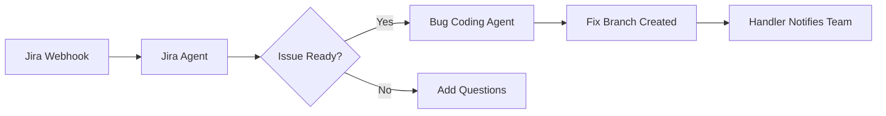

# Command SDK - Spring Boot AI Agent Orchestration Platform

A production-ready Spring Boot SDK for building AI-powered automation systems that respond to webhooks, process events, and execute intelligent workflows. The Command SDK provides a robust framework for integrating AI agents with enterprise tools like Jira, Snyk, GitHub, and custom services through the Model Context Protocol (MCP).

## What is Command SDK?

Command SDK is an enterprise-grade framework that bridges the gap between external events (webhooks, scheduled tasks) and AI-powered automation. It provides:

- **Event-Driven Architecture**: Receive webhooks from external services and transform them into AI agent tasks
- **AI Agent Orchestration**: Execute sophisticated AI workflows using Claude, GPT-4, or other LLMs
- **MCP Integration**: Connect to any tool or service through the Model Context Protocol
- **Enterprise Messaging**: Built-in ActiveMQ support for reliable, scalable event processing
- **Production Monitoring**: Comprehensive health checks, Prometheus metrics, and observability
- **Extensible Framework**: Clear separation between framework code and customer customizations

## Table of Contents
- [Key Concepts](#key-concepts)
- [Use Cases](#use-cases)
- [Features](#features)
- [Architecture Overview](#architecture-overview)
- [Module Structure](#module-structure)
- [Quick Start](#quick-start)
- [Docker Deployment](#docker-deployment)
- [Pre-Built Agents](#pre-built-agents)
- [Health Checks & Monitoring](#health-checks--monitoring)
  - [Health Check Endpoints](#health-check-endpoints)
  - [Prometheus Metrics](#prometheus-metrics)
  - [Custom MCP Server Metrics](#custom-mcp-server-metrics)
  - [Custom WebSocket Metrics](#custom-websocket-metrics)
- [Developer Guide](#developer-guide)
  - [Adding a New Webhook Controller](#adding-a-new-webhook-controller)
  - [Creating a Custom Handler](#creating-a-custom-handler)
  - [Adding a Scheduler](#adding-a-scheduler)
  - [Extending Agent Workflows](#extending-agent-workflows)
- [Configuration](#configuration)
- [Messaging System](#messaging-system)
- [Testing](#testing)
- [Troubleshooting](#troubleshooting)
- [Technology Stack](#technology-stack)

---

## Key Concepts

### 1. **Event-Driven AI Orchestration**
The SDK transforms external events (webhooks, scheduled tasks, API calls) into AI agent tasks. Each event flows through a pipeline: Controller → Message Queue → Agent Engine → Handler.

### 2. **Model Context Protocol (MCP)**
MCP is an open standard for connecting AI models to external tools and data sources. Command SDK uses MCP to give AI agents access to:
- File systems and code repositories
- APIs and databases
- Build tools and test runners
- Custom enterprise tools

### 3. **Agent Workflows**
Agents are AI-powered workflows defined in YAML that:
- Receive structured input from events
- Execute tasks using MCP tools
- Return structured output
- Trigger follow-up actions via handlers

### 4. **Handler Pattern**
Handlers are post-processing components that execute after an agent completes. They can:
- Transform and publish results
- Trigger additional agents
- Send notifications
- Update external systems

---

## Use Cases

### **DevOps Automation**
- **Automated Code Reviews**: Analyze pull requests and provide feedback
- **Bug Fixing**: Automatically fix bugs based on Jira tickets
- **Security Remediation**: Fix vulnerabilities detected by Snyk/SonarQube
- **CI/CD Pipeline Management**: Respond to build failures, deploy applications

### **IT Operations**
- **Incident Response**: Automatically investigate and remediate alerts
- **Infrastructure Management**: Provision resources based on requests
- **Monitoring & Alerting**: Intelligent alert correlation and response
- **Compliance Automation**: Ensure systems meet regulatory requirements

### **Business Process Automation**
- **Customer Support**: Process support tickets with AI assistance
- **Document Processing**: Extract and process information from documents
- **Workflow Orchestration**: Chain multiple AI agents for complex workflows
- **Data Pipeline Management**: Intelligent data processing and transformation

### **Security Operations**
- **Vulnerability Management**: Prioritize and remediate security issues
- **Threat Response**: Automated investigation of security events
- **Compliance Monitoring**: Continuous compliance checking
- **Access Management**: Intelligent access request processing

---

## Features

✅ **Webhook Integration**: Receive and validate webhooks from external services (Snyk, Jira)  
✅ **AI Agent Orchestration**: Execute AI-powered workflows with configurable agents  
✅ **Message Queue Integration**: ActiveMQ-based event processing with transaction support  
✅ **Handler Pattern**: Post-processing handlers for agent completion workflows  
✅ **MCP Client Integration**: Model Context Protocol client support for tool execution  
✅ **Spring Boot Best Practices**: Auto-configuration, health checks, virtual threads  
✅ **Extensible Architecture**: Easy to add controllers, handlers, schedulers, and agents  

---

## Architecture Overview

```
┌─────────────────┐
│  Webhook/API    │ ← External triggers (Snyk, Jira, Custom)
└────────┬────────┘
         │
         ▼
┌─────────────────┐
│  Controllers    │ ← Validate, transform, publish to queue
└────────┬────────┘
         │
         ▼
┌─────────────────┐
│  Message Queue  │ ← ActiveMQ (event, response, audit topics)
└────────┬────────┘
         │
         ▼
┌─────────────────┐
│  Agent Engine   │ ← Execute AI workflows (defined in agent.yml)
└────────┬────────┘
         │
         ▼
┌─────────────────┐
│  Handlers       │ ← Post-process results, trigger next steps
└─────────────────┘
```

**Key Packages:**
- `ai.qodo.command.app.controllers` - Webhook endpoints and REST APIs (customer-editable)
- `ai.qodo.command.app.handlers` - Post-agent completion handlers (customer-editable)
- `ai.qodo.command.internal.service` - Core services (messaging, sessions, agents)
- `ai.qodo.command.internal.config` - Spring configuration classes

---

## Module Structure

The project is organized into two main modules with distinct purposes:

### `app` Module (Customer-Editable)
**Location:** `/app/src/main/java/ai/qodo/command/app/`

This module contains customer-facing code that **should be modified** to add custom functionality:

- **Controllers** (`controllers/`) - Add webhook endpoints for external services
- **Handlers** (`handlers/`) - Implement post-agent completion logic
- **Configuration** (`config/`) - Add custom Spring configurations
- **Resources** (`resources/`) - Application configuration files

**Examples of what to add here:**
- New webhook controllers (GitHub, GitLab, custom services)
- Custom agent handlers for post-processing
- Service-specific validators
- Custom Spring beans and configurations

### `internal-core` Module (Framework Code - Do Not Edit)
**Location:** `/internal-core/src/main/java/ai/qodo/command/internal/`

This module contains the core framework code that **should NOT be modified** by customers:

- **Services** (`service/`) - Core messaging, WebSocket, agent orchestration
- **API Models** (`api/`) - Request/response data structures
- **MCP Integration** (`mcp/`) - Model Context Protocol client management
- **Metrics** (`metrics/`) - Prometheus metrics for MCP and WebSocket
- **Actuators** (`actuator/`) - Custom health indicators
- **Configuration** (`config/`) - Core Spring Boot auto-configuration

**⚠️ Important:** Modifying the `internal-core` module may break core functionality and is not supported. All customizations should be made in the `app` module.

---

## Quick Start

### Prerequisites

- Java 21 or higher
- Gradle 8.x
- Docker and Docker Compose (for containerized deployment)
- ActiveMQ (can be run via Docker)

### Running the Application

```bash
# Clone the repository
git clone https://github.com/davidparry/command-sdk.git
cd command-sdk

# Build the project
./gradlew clean build

# Run with default settings
./gradlew bootRun

# Custom port
./gradlew bootRun --args='--server.port=8082'

# With ActiveMQ
export MESSAGING_PROVIDER=activemq
export MESSAGING_ACTIVEMQ_BROKER_URL=tcp://localhost:61616
export WEBSOCKET_TOKEN=your-token-here
./gradlew bootRun
```

---

## Docker Deployment

### Quick Start with Docker Compose

```bash
# Clone the repository
git clone https://github.com/davidparry/command-sdk.git
cd command-sdk

# Create .env file from example
cp .env.example .env
# Edit .env and set your configuration values

# Start all services (ActiveMQ + Command SDK)
docker-compose -f docker/docker-compose.yml up -d

# View logs
docker-compose -f docker/docker-compose.yml logs -f command-sdk

# Stop services
docker-compose -f docker/docker-compose.yml down
```

### Docker Compose Services

The `docker/docker-compose.yml` includes:

1. **ActiveMQ** - Message broker for event processing
   - Web Console: http://localhost:8161 (admin/admin)
   - Broker URL: tcp://localhost:61616

2. **Command SDK** - The main application
   - API: http://localhost:8081
   - Health: http://localhost:8081/actuator/health
   - Metrics: http://localhost:8081/actuator/prometheus

### Building Docker Image

```bash
# Build the Docker image
docker build -t command-sdk:latest .

# Run standalone (requires external ActiveMQ)
docker run -p 8081:8081 \
  -e WEBSOCKET_TOKEN=your-token \
  -e MESSAGING_ACTIVEMQ_BROKER_URL=tcp://host.docker.internal:61616 \
  command-sdk:latest
```

### Environment Variables for Docker

Create a `.env` file with:

```bash
# Required
WEBSOCKET_TOKEN=your-websocket-token

# ActiveMQ Configuration
ACTIVEMQ_USERNAME=qodo
ACTIVEMQ_PASSWORD=qodo

# Webhook Secrets
SNYK_WEBHOOK_SECRET=your-snyk-secret
JIRA_WEBHOOK_SECRET=your-jira-secret

# Atlassian/Jira Configuration
ATLASSIAN_EMAIL=your-email@company.com
ATLASSIAN_SITE_URL=https://your-company.atlassian.net
ATLASSIAN_API_TOKEN=your-atlassian-api-token

# Git Configuration (for agents that use Git)
GIT_SSH_PRIVATE_KEY=your-ssh-private-key

# MCP Timeout (seconds)
QODO_MCP_REQUEST_TIMEOUT_SECONDS=300

# Logging Level
LOGGING_LEVEL_AI_QODO_COMMAND_INTERNAL=INFO
```

### Docker Volume Mounts

The Docker setup includes volume mounts for:
- Agent data: `${HOME}/code/docker_mnt/compose-command-sdk/command-sdk:/app/data`
- Customize the path in `docker/docker-compose.yml` as needed

---

## Pre-Built Agents

The Command SDK comes with three production-ready AI agents:

### 1. **Snyk Security Agent** (`snyk_agent`)

**Purpose**: Analyzes and remediates security vulnerabilities detected by Snyk.

**Triggers**: Snyk webhook events (new vulnerabilities)

**Capabilities**:
- Analyzes vulnerability details (CVSS score, exploit maturity)
- Provides remediation guidance (upgrade paths, patches)
- Suggests temporary mitigations (WAF rules, configuration changes)
- Creates validation plans and follow-up actions

**Configuration**:
```yaml
# Triggered by Snyk webhooks to /api/webhooks/snyk
# Requires: SNYK_WEBHOOK_SECRET environment variable
```

### 2. **Jira Issue Agent** (`jira_agent`)

**Purpose**: Analyzes Jira issues and ensures they have sufficient information for development.

**Triggers**: Jira webhook events or manual trigger

**Capabilities**:
- Retrieves and analyzes Jira issue details
- Reviews comments and attachments
- Identifies missing information
- Adds clarifying questions as comments
- Updates issue status when ready for development

**Configuration**:
```yaml
# Triggered by Jira webhooks to /api/webhooks/jira/{issueKey}
# Requires: ATLASSIAN_EMAIL, ATLASSIAN_SITE_URL, ATLASSIAN_API_TOKEN
```

### 3. **Coding Agent** (`coding_agent`)

**Purpose**: Automatically fixes bugs based on Jira tickets.

**Triggers**: Follows after Jira Issue Agent when issue is ready

**Capabilities**:
- Clones the repository from Jira issue
- Creates a feature branch
- Analyzes code to find root cause
- Implements and tests the fix
- Commits and pushes changes
- Documents the fix in Markdown

**Configuration**:
```yaml
# Triggered after jira_agent completes
# Requires: GIT_SSH_PRIVATE_KEY for repository access
```

### Agent Workflow Example



### Customizing Pre-Built Agents

Edit `agent.yml` to customize:
- **Model**: Change from `claude-4.5-sonnet` to other models
- **Instructions**: Modify the agent's behavior
- **Output Schema**: Change the structured output format
- **MCP Servers**: Add or remove tool access
- **Exit Expression**: Modify completion conditions

---

## Health Checks & Monitoring

The application provides comprehensive health checks and Prometheus metrics for monitoring system health, MCP server status, and WebSocket connections.

### Health Check Endpoints

#### Main Health Endpoint
```bash
# Overall application health (includes all health indicators)
curl http://localhost:8080/actuator/health
```

**Response Example:**
```json
{
  "status": "UP",
  "components": {
    "diskSpace": {
      "status": "UP",
      "details": {
        "total": 500000000000,
        "free": 250000000000,
        "threshold": 10485760,
        "exists": true
      }
    },
    "jms": {
      "status": "UP",
      "details": {
        "provider": "ActiveMQ"
      }
    },
    "mcpServersHealthIndicator": {
      "status": "UP",
      "details": {
        "mcpServers": {
          "github-server": "UP",
          "filesystem-server": "UP",
          "jira_agent-confluence-server": "UP",
          "git-server": "UP"
        }
      }
    },
    "ping": {
      "status": "UP"
    }
  }
}
```

#### Info Endpoint
```bash
# Application information
curl http://localhost:8080/actuator/info
```

### Prometheus Metrics

The application exposes Prometheus-compatible metrics for monitoring and alerting.

#### Metrics Endpoint
```bash
# All Prometheus metrics
curl http://localhost:8080/actuator/prometheus

# All Micrometer metrics (JSON format)
curl http://localhost:8080/actuator/metrics

# Specific metric details
curl http://localhost:8080/actuator/metrics/qodo_mcp_active_servers
curl http://localhost:8080/actuator/metrics/qodo_ws_active_connections
```

### Custom MCP Server Metrics

The application tracks detailed metrics for Model Context Protocol (MCP) server operations:

#### MCP Server Connection Metrics
- **`qodo_mcp_active_servers`** - Number of active MCP server connections
- **`qodo_mcp_initialized_servers`** - Successfully initialized MCP servers
- **`qodo_mcp_failed_servers`** - MCP servers that failed to initialize
- **`qodo_mcp_servers_no_tools`** - MCP servers with no tools registered
- **`qodo_mcp_registered_tools`** - Total number of registered tools across all servers

#### MCP Tool Execution Metrics
- **`qodo_mcp_tool_invocations_total`** - Total tool invocations (tagged by `server` and `tool`)
- **`qodo_mcp_tool_invocations_success`** - Successful tool invocations (tagged by `server` and `tool`)
- **`qodo_mcp_tool_invocations_failure`** - Failed tool invocations (tagged by `server` and `tool`)
- **`qodo_mcp_tool_execution_time`** - Tool execution duration timer (tagged by `server` and `tool`)

**Example Prometheus Queries:**
```promql
# Average tool execution time by server
rate(qodo_mcp_tool_execution_time_sum[5m]) / rate(qodo_mcp_tool_execution_time_count[5m])

# Tool success rate
rate(qodo_mcp_tool_invocations_success[5m]) / rate(qodo_mcp_tool_invocations_total[5m])

# Failed servers alert
qodo_mcp_failed_servers > 0
```

### Custom WebSocket Metrics

The application tracks WebSocket connection health:

- **`qodo_ws_active_connections`** - Number of active WebSocket connections in the JVM

**Example Prometheus Queries:**
```promql
# Alert when no WebSocket connections
qodo_ws_active_connections == 0

# WebSocket connection trend
rate(qodo_ws_active_connections[5m])
```

### MCP Server Health Indicator

The custom `McpServersHealthIndicator` performs active health checks on all MCP servers:

- Checks servers from `mcp.json` configuration
- Validates agent-specific MCP servers from `agent.yml`
- Tests server connectivity by calling `listTools()`
- Reports individual server status in health endpoint

**Health Check Details:**
```bash
curl http://localhost:8080/actuator/health | jq '.components.mcpServersHealthIndicator'
```

**Response:**
```json
{
  "status": "UP",
  "details": {
    "mcpServers": {
      "github-server": "UP",
      "filesystem-server": "UP",
      "jira_agent-confluence-server": "UP",
      "git-server": "UP"
    }
  }
}
```

If any server is down:
```json
{
  "status": "DOWN",
  "details": {
    "mcpServers": {
      "github-server": "UP",
      "filesystem-server": "DOWN: Connection refused",
      "git-server": "UP"
    }
  }
}
```

### Monitoring Best Practices

1. **Set up Prometheus scraping:**
   ```yaml
   scrape_configs:
     - job_name: 'command-sdk'
       metrics_path: '/actuator/prometheus'
       static_configs:
         - targets: ['localhost:8080']
   ```

2. **Create alerts for critical metrics:**
   - MCP server failures: `qodo_mcp_failed_servers > 0`
   - No WebSocket connections: `qodo_ws_active_connections == 0`
   - High tool failure rate: `rate(qodo_mcp_tool_invocations_failure[5m]) > 0.1`

3. **Monitor health endpoint:**
   - Use Kubernetes liveness/readiness probes
   - Set up external monitoring (Pingdom, UptimeRobot)
   - Configure load balancer health checks

4. **Dashboard recommendations:**
   - MCP server status overview
   - Tool execution performance by server/tool
   - WebSocket connection stability
   - JMS queue depth and processing rate

---

## Developer Guide

### Adding a New Webhook Controller

**Use Case:** You want to add a webhook endpoint for GitHub, GitLab, or any external service.

#### Step 1: Create the Controller

Create a new controller in `src/main/java/ai/qodo/command/controllers/`:

```java
package ai.qodo.command.controllers;

import ai.qodo.command.internal.service.MessagePublisher;
import com.fasterxml.jackson.databind.ObjectMapper;
import org.slf4j.Logger;
import org.slf4j.LoggerFactory;
import org.springframework.beans.factory.annotation.Value;
import org.springframework.http.HttpStatus;
import org.springframework.http.ResponseEntity;
import org.springframework.web.bind.annotation.*;

import java.time.Instant;
import java.util.HashMap;
import java.util.Map;

import static ai.qodo.command.internal.service.MessagePublisher.MSG_TYPE;

/**
 * Controller to handle GitHub webhook events.
 * Supports events like push, pull_request, issues, etc.
 */
@RestController
@RequestMapping("/api/webhooks")
public class GitHubWebhookController {

    private static final Logger logger = LoggerFactory.getLogger(GitHubWebhookController.class);
    private static final String HEADER_EVENT = "X-GitHub-Event";
    private static final String HEADER_SIGNATURE = "X-Hub-Signature-256";
    private static final String MSG_GITHUB = "github_agent";

    private final ObjectMapper objectMapper;
    private final MessagePublisher messagePublisher;
    private final GitHubWebhookValidator validator; // Create this similar to SnykWebhookValidator

    @Value("${messaging.queue.event}")
    private String eventTopic;

    public GitHubWebhookController(ObjectMapper objectMapper, 
                                   MessagePublisher messagePublisher,
                                   GitHubWebhookValidator validator) {
        this.objectMapper = objectMapper;
        this.messagePublisher = messagePublisher;
        this.validator = validator;
    }

    @PostMapping("/github")
    public ResponseEntity<?> handleGitHubWebhook(
            @RequestHeader(value = HEADER_EVENT, required = false) String eventType,
            @RequestHeader(value = HEADER_SIGNATURE, required = false) String signature,
            @RequestBody String rawBody) {

        logger.info("Received GitHub webhook - Event: {}", eventType);

        try {
            // Validate signature
            if (!validator.validateSignature(rawBody, signature)) {
                logger.error("GitHub webhook signature validation failed");
                return ResponseEntity.status(HttpStatus.UNAUTHORIZED)
                    .body(Map.of("error", "Invalid signature"));
            }

            // Parse payload
            Map<String, Object> payload = objectMapper.readValue(rawBody, Map.class);
            
            // Add metadata
            payload.put(HEADER_EVENT, eventType);
            payload.put(MSG_TYPE, MSG_GITHUB);
            payload.put("EventKey", String.format("%s_%s_%s", 
                eventType, 
                payload.get("repository"), 
                System.currentTimeMillis()));

            // Publish to message queue
            String message = objectMapper.writeValueAsString(payload);
            messagePublisher.publish(eventTopic, message);

            logger.info("Successfully processed GitHub webhook: {}", eventType);
            return ResponseEntity.ok(Map.of("status", "success"));

        } catch (Exception e) {
            logger.error("Error processing GitHub webhook", e);
            return ResponseEntity.status(HttpStatus.INTERNAL_SERVER_ERROR)
                .body(Map.of("error", "Internal server error"));
        }
    }

    @GetMapping("/github/health")
    public ResponseEntity<?> healthCheck() {
        return ResponseEntity.ok(Map.of(
            "status", "healthy",
            "service", "GitHub Webhook Handler",
            "timestamp", Instant.now().toString()
        ));
    }
}
```

#### Step 2: Create Webhook Validator (Optional but Recommended)

```java
package ai.qodo.command.controllers;

import org.springframework.beans.factory.annotation.Value;
import org.springframework.stereotype.Component;

import javax.crypto.Mac;
import javax.crypto.spec.SecretKeySpec;
import java.nio.charset.StandardCharsets;
import java.security.MessageDigest;

@Component
public class GitHubWebhookValidator {

    @Value("${github.webhook.secret}")
    private String webhookSecret;

    @Value("${github.webhook.validate-signature:true}")
    private boolean validateSignature;

    public boolean validateSignature(String payload, String signature) {
        if (!validateSignature) {
            return true;
        }

        try {
            Mac mac = Mac.getInstance("HmacSHA256");
            SecretKeySpec secretKey = new SecretKeySpec(
                webhookSecret.getBytes(StandardCharsets.UTF_8), "HmacSHA256");
            mac.init(secretKey);
            
            byte[] hash = mac.doFinal(payload.getBytes(StandardCharsets.UTF_8));
            String expected = "sha256=" + bytesToHex(hash);
            
            return MessageDigest.isEqual(
                expected.getBytes(StandardCharsets.UTF_8),
                signature.getBytes(StandardCharsets.UTF_8)
            );
        } catch (Exception e) {
            return false;
        }
    }

    private String bytesToHex(byte[] bytes) {
        StringBuilder result = new StringBuilder();
        for (byte b : bytes) {
            result.append(String.format("%02x", b));
        }
        return result.toString();
    }
}
```

#### Step 3: Add Configuration

Add to `src/main/resources/application.yml`:

```yaml
github:
  webhook:
    secret: ${GITHUB_WEBHOOK_SECRET:your-secret-here}
    validate-signature: ${GITHUB_WEBHOOK_VALIDATION_ENABLED:true}
```

---

### Creating a Custom Handler

**Use Case:** After an AI agent completes its workflow, you want to perform custom actions like sending notifications, updating databases, or triggering another agent.

#### Understanding the Agent-to-Handler Mapping

**CRITICAL CONCEPT:** The handler bean name MUST exactly match the command name from `agent.yml`.

The mapping works as follows:

1. **In `agent.yml`**, you define a command with a specific name:
   ```yaml
   commands:
     github_agent:        # ← This is the command name
       description: "..."
       instructions: "..."
   ```

2. **In your Handler class**, the `@Service` annotation MUST use that exact command name + the suffix `-handler`:
   ```java
   @Service("github_agent" + HANDLER_SUFFIX)  // ← "github_agent" matches the command name
   public class GitHubAgentHandler implements Handler {
   ```

3. **The constant `HANDLER_SUFFIX`** is defined in the `Handler` interface as `"-handler"`, so:
   - Command name: `github_agent`
   - Handler bean name: `github_agent-handler`
   - Full annotation: `@Service("github_agent" + HANDLER_SUFFIX)`

**Real Examples from this Project:**

| agent.yml Command Name | Handler Class | @Service Annotation | Bean Name |
|--------------------|---------------|---------------------|-----------|
| `snyk_agent` | `SnykAgentHandler` | `@Service("snyk_agent" + HANDLER_SUFFIX)` | `snyk_agent-handler` |
| `jira_agent` | `JiraAgentHandler` | `@Service("jira_agent" + HANDLER_SUFFIX)` | `jira_agent-handler` |
| `coding_agent` | `CodingAgentHandler` | `@Service("coding_agent" + HANDLER_SUFFIX)` | `coding_agent-handler` |

**How the Framework Finds Your Handler:**

When an agent completes its workflow, the framework:
1. Reads the command name from the agent execution context (e.g., `github_agent`)
2. Appends `-handler` to create the bean name (e.g., `github_agent-handler`)
3. Looks up the Spring bean with that exact name
4. Calls the `handle()` method on your handler

**Common Mistakes to Avoid:**

❌ **Wrong:** Using a different name in @Service
```java
@Service("GitHubHandler")  // Won't be found!
```

❌ **Wrong:** Forgetting the HANDLER_SUFFIX constant
```java
@Service("github_agent-handler")  // Hardcoded, not recommended
```

✅ **Correct:** Using the exact command name + HANDLER_SUFFIX
```java
@Service("github_agent" + HANDLER_SUFFIX)  // Perfect!
```

#### Step 1: Implement the Handler Interface

Create a handler in `src/main/java/ai/qodo/command/handlers/`:

```java
package ai.qodo.command.handlers;

import ai.qodo.command.internal.api.TaskResponse;
import ai.qodo.command.internal.pojo.CommandSession;
import ai.qodo.command.internal.service.MessagePublisher;
import com.fasterxml.jackson.databind.ObjectMapper;
import org.slf4j.Logger;
import org.slf4j.LoggerFactory;
import org.springframework.context.annotation.Scope;
import org.springframework.stereotype.Service;

import java.util.HashMap;
import java.util.List;
import java.util.Map;

import static ai.qodo.command.handlers.Handler.HANDLER_SUFFIX;

/**
 * Handler for GitHub agent completion.
 * Processes agent results and triggers follow-up actions.
 */
@Service("github_agent" + HANDLER_SUFFIX)
@Scope("prototype")
public class GitHubAgentHandler implements Handler {

    private static final Logger logger = LoggerFactory.getLogger(GitHubAgentHandler.class);
    
    private final MessagePublisher messagePublisher;
    private final ObjectMapper objectMapper;

    public GitHubAgentHandler(MessagePublisher messagePublisher, ObjectMapper objectMapper) {
        this.messagePublisher = messagePublisher;
        this.objectMapper = objectMapper;
    }

    @Override
    public void handle(CommandSession commandSession, List<TaskResponse> allTaskResponses) {
        String eventKey = commandSession.eventKey();
        String sessionId = commandSession.sessionId();
        
        logger.info("Processing GitHub agent completion - Session: {}, Event: {}", 
            sessionId, eventKey);

        try {
            // Extract structured output from agent responses
            Map<String, Object> result = new HashMap<>();
            result.put("sessionId", sessionId);
            result.put("eventKey", eventKey);
            result.put("timestamp", System.currentTimeMillis());

            for (TaskResponse response : allTaskResponses) {
                if ("structured_output".equalsIgnoreCase(response.type())) {
                    // Process structured output
                    result.putAll(response.data().toolArgs());
                }
            }

            // Option 1: Publish to response queue for external consumption
            messagePublisher.publishResponse(objectMapper.writeValueAsString(result));

            // Option 2: Trigger another agent workflow
            if (shouldTriggerNextAgent(result)) {
                Map<String, Object> nextAgentPayload = buildNextAgentPayload(result);
                messagePublisher.publishEvent(objectMapper.writeValueAsString(nextAgentPayload));
                logger.info("Triggered next agent workflow for session: {}", sessionId);
            }

            // Option 3: Send external notification (webhook, email, etc.)
            sendExternalNotification(result);

            logger.info("Successfully handled GitHub agent completion: {}", sessionId);

        } catch (Exception e) {
            logger.error("Error handling GitHub agent completion", e);
        }
    }

    private boolean shouldTriggerNextAgent(Map<String, Object> result) {
        // Add your logic to determine if another agent should be triggered
        return result.containsKey("requiresCodeReview") && 
               Boolean.TRUE.equals(result.get("requiresCodeReview"));
    }

    private Map<String, Object> buildNextAgentPayload(Map<String, Object> result) {
        Map<String, Object> payload = new HashMap<>();
        payload.put("type", "code_review_agent");
        payload.put("sourceSession", result.get("sessionId"));
        payload.put("pullRequestUrl", result.get("pullRequestUrl"));
        payload.put("EventKey", "code_review_" + System.currentTimeMillis());
        return payload;
    }

    private void sendExternalNotification(Map<String, Object> result) {
        // Implement external notification logic (Slack, email, etc.)
        logger.info("Sending notification for result: {}", result);
    }
}
```

#### Step 2: Verify the Mapping

After creating your handler, verify the mapping is correct:

1. **Check agent.yml** - Find your command name:
   ```yaml
   commands:
     github_agent:  # ← This is what you need
   ```

2. **Check your Handler** - Ensure @Service matches:
   ```java
   @Service("github_agent" + HANDLER_SUFFIX)  // ← Must match exactly
   ```

3. **Test the handler** - Trigger the agent and check logs:
   ```
   Successfully found handler: github_agent-handler
   ```

If you see "Handler not found" errors, the names don't match!

---

### Adding a Scheduler

**Use Case:** You want to periodically poll an external API, check for updates, or trigger maintenance tasks.

#### Step 1: Enable Scheduling

Add to your main application class or create a configuration class:

```java
package ai.qodo.command.internal.config;

import org.springframework.context.annotation.Configuration;
import org.springframework.scheduling.annotation.EnableScheduling;

@Configuration
@EnableScheduling
public class SchedulingConfig {
    // Scheduling is now enabled
}
```

#### Step 2: Create a Scheduled Service

```java
package ai.qodo.command.internal.service;

import ai.qodo.command.internal.service.MessagePublisher;
import com.fasterxml.jackson.databind.ObjectMapper;
import org.slf4j.Logger;
import org.slf4j.LoggerFactory;
import org.springframework.beans.factory.annotation.Value;
import org.springframework.scheduling.annotation.Scheduled;
import org.springframework.stereotype.Service;
import org.springframework.web.client.RestTemplate;

import java.util.HashMap;
import java.util.Map;

/**
 * Scheduler to poll external API and trigger agent workflows.
 */
@Service
public class ApiPollingScheduler {

    private static final Logger logger = LoggerFactory.getLogger(ApiPollingScheduler.class);

    private final RestTemplate restTemplate;
    private final MessagePublisher messagePublisher;
    private final ObjectMapper objectMapper;

    @Value("${polling.api.url}")
    private String apiUrl;

    @Value("${polling.api.enabled:false}")
    private boolean pollingEnabled;

    @Value("${messaging.queue.event}")
    private String eventTopic;

    public ApiPollingScheduler(RestTemplate restTemplate, 
                               MessagePublisher messagePublisher,
                               ObjectMapper objectMapper) {
        this.restTemplate = restTemplate;
        this.messagePublisher = messagePublisher;
        this.objectMapper = objectMapper;
    }

    /**
     * Poll API every 5 minutes (300,000 ms).
     * Use cron expression for more complex schedules: @Scheduled(cron = "0 */5 * * * *")
     */
    @Scheduled(fixedDelay = 300000, initialDelay = 60000)
    public void pollExternalApi() {
        if (!pollingEnabled) {
            return;
        }

        logger.info("Polling external API: {}", apiUrl);

        try {
            // Call external API
            Map<String, Object> response = restTemplate.getForObject(apiUrl, Map.class);

            if (response != null && hasNewData(response)) {
                // Prepare message for agent processing
                Map<String, Object> payload = new HashMap<>();
                payload.put("type", "polling_agent");
                payload.put("source", "scheduled_poll");
                payload.put("data", response);
                payload.put("EventKey", "poll_" + System.currentTimeMillis());

                // Publish to event queue
                String message = objectMapper.writeValueAsString(payload);
                messagePublisher.publish(eventTopic, message);

                logger.info("Published polling event to queue");
            }

        } catch (Exception e) {
            logger.error("Error polling external API", e);
        }
    }

    private boolean hasNewData(Map<String, Object> response) {
        // Implement your logic to check if there's new data
        return response.containsKey("updates") && 
               !((List<?>) response.get("updates")).isEmpty();
    }

    /**
     * Example: Daily cleanup task at 2 AM
     */
    @Scheduled(cron = "0 0 2 * * *")
    public void dailyCleanup() {
        logger.info("Running daily cleanup task");
        // Implement cleanup logic
    }
}
```

#### Step 3: Add Configuration

```yaml
polling:
  api:
    url: ${POLLING_API_URL:https://api.example.com/updates}
    enabled: ${POLLING_ENABLED:false}
```

#### Step 4: Configure RestTemplate Bean

```java
package ai.qodo.command.internal.config;

import org.springframework.context.annotation.Bean;
import org.springframework.context.annotation.Configuration;
import org.springframework.web.client.RestTemplate;

@Configuration
public class RestTemplateConfig {

    @Bean
    public RestTemplate restTemplate() {
        return new RestTemplate();
    }
}
```

---

### Extending Agent Workflows

**Use Case:** You want to add a new AI agent workflow or modify existing ones.

#### Step 1: Define Agent in agent.yml

Add your agent configuration to `src/main/resources/agent.yml`:

```yaml
commands:
  github_agent:
    description: "Analyze GitHub pull requests and provide code review feedback"
    
    instructions: |
      You are a code review assistant analyzing pull request: {/pullRequestUrl}
      
      1. Fetch the PR details using the GitHub API
      2. Review the code changes for:
         - Code quality and best practices
         - Security vulnerabilities
         - Performance issues
         - Test coverage
      3. Provide actionable feedback
      
      Output your analysis in the configured schema.
    
    model: "claude-4-sonnet"
    
    mcpServers: |
      {
        "mcpServers": {
          "github-server": {
            "command": "npx",
            "args": ["-y", "@modelcontextprotocol/server-github"],
            "env": {
              "GITHUB_TOKEN": "{GITHUB_TOKEN}"
            }
          }
        }
      }
    
    tools: ["shell", "github-server"]
    execution_strategy: "act"
    
    output_schema: |
      {
        "properties": {
          "success": {
            "type": "boolean",
            "description": "Whether the review was completed successfully"
          },
          "issues": {
            "type": "array",
            "items": {
              "type": "object",
              "properties": {
                "severity": {"type": "string"},
                "file": {"type": "string"},
                "line": {"type": "number"},
                "message": {"type": "string"}
              }
            }
          },
          "summary": {
            "type": "string",
            "description": "Overall review summary"
          }
        },
        "required": ["success", "issues", "summary"]
      }
    
    exit_expression: "success"
```

#### Step 2: Create the Handler

Follow the [Creating a Custom Handler](#creating-a-custom-handler) section to create `GitHubAgentHandler`.

#### Step 3: Trigger the Agent

Publish a message to the event queue with the correct `type` field:

```java
Map<String, Object> payload = new HashMap<>();
payload.put("type", "github_agent");
payload.put("pullRequestUrl", "https://github.com/owner/repo/pull/123");
payload.put("EventKey", "pr_review_" + System.currentTimeMillis());

messagePublisher.publishEvent(objectMapper.writeValueAsString(payload));
```

---

## Configuration

### Application Properties

Key configuration in `src/main/resources/application.yml`:

```yaml
qodo:
  baseUrl: ${COMMAND_BASE_URL:https://api.command.qodo.ai}
  blockedTools: ${QODO_BLOCKED_TOOLS:}
  agent:
    configFile: ${QODO_AGENT_CONFIG_FILE:classpath:agent.yml}
  mcp:
    request-timeout-seconds: ${QODO_MCP_REQUEST_TIMEOUT_SECONDS:90}
  websocket:
    token: ${WEBSOCKET_TOKEN}

# Messaging
messaging:
  provider: ${MESSAGING_PROVIDER:activemq}
  queue:
    audit: ${MESSAGING_DEFAULT_TOPIC:audit}
    event: ${MESSAGING_EVENT_TOPIC:event}
    response: ${MESSAGING_RESPONSE_TOPIC:response}
  activemq:
    broker-url: ${MESSAGING_ACTIVEMQ_BROKER_URL:tcp://localhost:61616}
    username: ${MESSAGING_ACTIVEMQ_USERNAME:qodo}
    password: ${MESSAGING_ACTIVEMQ_PASSWORD:qodo}

# Server
server:
  port: ${SERVER_PORT:8080}

# Virtual Threads (Java 21+)
spring:
  threads:
    virtual:
      enabled: true
```

### Environment Variables

```bash
# Required
export WEBSOCKET_TOKEN=your-token
export MESSAGING_PROVIDER=activemq
export MESSAGING_ACTIVEMQ_BROKER_URL=tcp://localhost:61616

# Optional
export SNYK_WEBHOOK_SECRET=your-snyk-secret
export JIRA_WEBHOOK_SECRET=your-jira-secret
export GITHUB_WEBHOOK_SECRET=your-github-secret

# MCP Configuration
export QODO_MCP_REQUEST_TIMEOUT_SECONDS=300  # Increase timeout for long-running tools
```

### MCP Client Timeout Configuration

The MCP (Model Context Protocol) client timeout controls how long the application waits for MCP server tool responses before timing out. This is particularly important for long-running tools like `gradle_tester`, code analysis, or large file operations.

**Default Timeout:** 90 seconds

**Configuring the Timeout:**

1. **Via Environment Variable (Recommended for Docker):**
   ```bash
   export QODO_MCP_REQUEST_TIMEOUT_SECONDS=300  # 5 minutes
   ```

2. **Via application.yml:**
   ```yaml
   qodo:
     mcp:
       request-timeout-seconds: 300
   ```

3. **Via Docker Compose:**
   The `docker/docker-compose.yml` already includes this configuration with a default of 300 seconds:
   ```yaml
   environment:
     QODO_MCP_REQUEST_TIMEOUT_SECONDS: ${QODO_MCP_REQUEST_TIMEOUT_SECONDS:-300}
   ```

**When to Increase the Timeout:**

- **Build Tools:** Gradle, Maven, or npm operations that take longer than 90 seconds
- **Code Analysis:** Large codebases requiring extensive scanning
- **File Operations:** Processing large files or directories
- **External API Calls:** Tools that make slow external API requests
- **Database Operations:** Complex queries or migrations

**Example Timeout Values:**

- **Fast operations** (file read/write): 30-60 seconds
- **Standard operations** (code analysis): 90-120 seconds  
- **Build operations** (gradle, maven): 300-600 seconds (5-10 minutes)
- **Heavy operations** (full codebase scan): 600-1800 seconds (10-30 minutes)

**Monitoring Timeouts:**

Check the logs for timeout errors:
```bash
docker-compose -f docker/docker-compose.yml logs qodo-command | grep TimeoutException
```

Example timeout error:
```
Failed to invoke tool gradle_tester on server scout-server: 
java.util.concurrent.TimeoutException: Did not observe any item or terminal signal within 90000ms
```

**Restart After Configuration Change:**

```bash
# Stop the services
docker-compose -f docker/docker-compose.yml down

# Rebuild with new configuration
docker-compose -f docker/docker-compose.yml build qodo-command

# Start with new timeout
docker-compose -f docker/docker-compose.yml up -d
```

---

## Messaging System

The application uses a message queue (ActiveMQ) for event-driven architecture:

### Topics

1. **Event Topic** (`messaging.queue.event`): Incoming events from webhooks/schedulers
2. **Response Topic** (`messaging.queue.response`): Agent completion results
3. **Audit Topic** (`messaging.queue.audit`): Audit logs

### Publishing Messages

```java
@Autowired
private MessagePublisher messagePublisher;

// Publish to event queue
messagePublisher.publishEvent(jsonMessage);

// Publish to response queue
messagePublisher.publishResponse(jsonMessage);

```

### Message Format

```json
{
  "type": "agent_type",
  "EventKey": "unique_event_id",
  "timestamp": 1234567890,
  "data": {
    // Event-specific data
  }
}
```

---

## Testing

### Running Tests

```bash
./gradlew test
./gradlew integrationTest
```

### Testing Webhooks

```bash
# Test Snyk webhook
curl -X POST http://localhost:8080/api/webhooks/snyk \
  -H "Content-Type: application/json" \
  -H "X-Snyk-Event: project.snapshot" \
  -H "X-Snyk-Timestamp: 2024-01-01T00:00:00Z" \
  -d @test-payload.json

# Test Jira webhook
curl -X POST http://localhost:8080/api/webhooks/jira/PROJ-123 \
  -H "Content-Type: application/json" \
  -d @jira-payload.json
```

---

## Best Practices

1. **Controllers**: Always validate signatures, log events, handle errors gracefully
2. **Handlers**: Use `@Scope("prototype")` for stateful handlers, follow naming convention
3. **Schedulers**: Make polling configurable, add circuit breakers for external APIs
4. **Messaging**: Use transactions, handle redelivery, implement idempotency
5. **Configuration**: Externalize secrets, use environment variables, provide defaults
6. **Logging**: Use structured logging, include correlation IDs, log at appropriate levels

---

## Troubleshooting

### Handler Not Found
- Verify handler bean name matches: `{agent_type}-handler`
- Check `@Service` annotation includes correct name
- Ensure handler implements `Handler` interface

### Messages Not Processing
- Check ActiveMQ is running: `docker-compose -f docker/docker-compose.yml up activemq`
- Verify queue configuration in `application.yml`
- Check logs for transaction rollbacks

### Webhook Signature Validation Failing
- Verify webhook secret matches configuration
- Check signature algorithm (SHA256 vs SHA1)
- Ensure raw body is used for validation (not parsed JSON)

---

## Additional Resources

- [Spring Boot Documentation](https://spring.io/projects/spring-boot)
- [Spring Scheduling](https://spring.io/guides/gs/scheduling-tasks/)
- [ActiveMQ Documentation](https://activemq.apache.org/)
- [Model Context Protocol](https://modelcontextprotocol.io/)

---

## Technology Stack

### Core Framework
- **Java 21**: Latest LTS version with virtual threads support
- **Spring Boot 3.5.6**: Enterprise-grade application framework
- **Spring AI 1.0.1**: AI/LLM integration framework
- **Gradle 8.13**: Build automation tool

### Messaging & Integration
- **Apache ActiveMQ 6.1.4**: Message broker for event-driven architecture
- **Spring Integration**: Enterprise integration patterns
- **WebSocket (OkHttp3)**: Real-time bidirectional communication

### AI & MCP
- **Model Context Protocol SDK 0.12.0**: Tool integration for AI agents
- **Spring AI MCP Client**: MCP client implementation for Spring
- **Claude/GPT-4 Support**: Compatible with major LLM providers

### Monitoring & Observability
- **Spring Boot Actuator**: Production-ready features
- **Micrometer**: Application metrics facade
- **Prometheus**: Metrics collection and alerting
- **Custom Health Indicators**: MCP server health checks

### Data & Serialization
- **Jackson**: JSON/YAML/TOML processing
- **Spring WebFlux**: Reactive programming support for MCP

### Testing
- **JUnit 5**: Unit testing framework
- **Mockito**: Mocking framework
- **WireMock**: HTTP API mocking
- **Spring Boot Test**: Integration testing support

### Containerization
- **Docker**: Container runtime
- **Docker Compose**: Multi-container orchestration
- **Alpine Linux**: Lightweight base image

### Development Tools
- **Virtual Threads**: Java 21 lightweight concurrency
- **Lombok** (optional): Boilerplate code reduction
- **Git**: Version control

---

## License

This project is licensed under the GNU General Public License v3.0 (GPL-3.0) - see the [LICENSE.md](LICENSE.md) file for details.

Copyright (C) 2025 Qodo

This program is free software: you can redistribute it and/or modify it under the terms of the GNU General Public License as published by the Free Software Foundation, either version 3 of the License, or (at your option) any later version.

This program is distributed in the hope that it will be useful, but WITHOUT ANY WARRANTY; without even the implied warranty of MERCHANTABILITY or FITNESS FOR A PARTICULAR PURPOSE. See the GNU General Public License for more details.

You should have received a copy of the GNU General Public License along with this program. If not, see <https://www.gnu.org/licenses/>.

---

## Support

For issues, questions, or contributions:
- GitHub Issues: [https://github.com/davidparry/command-sdk/issues](https://github.com/davidparry/command-sdk/issues)
- Documentation: This README and inline code documentation
- Examples: See the `app` module for implementation examples

---

## Contributing

Please see our [CONTRIBUTING.md](CONTRIBUTING.md) for detailed guidelines on how to contribute, including code of conduct, development workflow, and guidelines for contributing to the `internal-core` module.

We welcome contributions such as:
- Bug fixes and feature enhancements to the core framework
- New example implementations in the `app` module
- Documentation improvements
- Testing enhancements

For quick reference when extending this application:
- Follow existing patterns (controllers, handlers, services)
- Add comprehensive logging
- Write unit and integration tests
- Update documentation (including this README and CONTRIBUTING.md)
- Use Spring Boot best practices

---

## Acknowledgments

- Spring Boot team for the excellent framework
- Model Context Protocol team for the MCP specification
- Qodo team for the original architecture design
- Open source community for various libraries and tools
